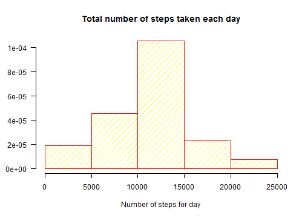
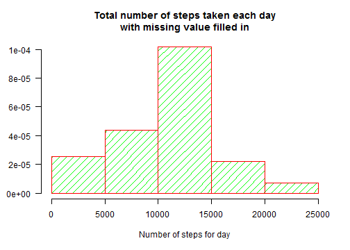
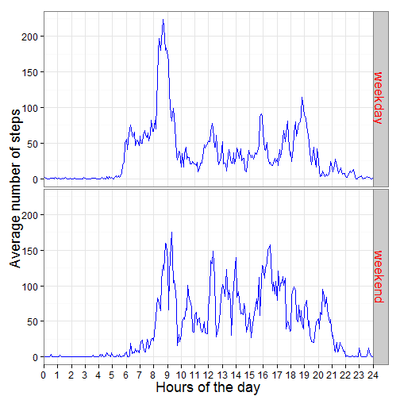

# Reproducible Research: Peer Assessment 1


## Loading and preprocessing the data ##

***read data and modify "interval" variable of data frame: one day is 288 intervals of 5 minutes***


```r
activity<- read.csv("activity.csv")
activity[286:290,]
```

```
##     steps       date interval
## 286    NA 2012-10-01     2345
## 287    NA 2012-10-01     2350
## 288    NA 2012-10-01     2355
## 289     0 2012-10-02        0
## 290     0 2012-10-02        5
```

```r
interval_new<- rep(1:288,61)
activity$interval<- interval_new
activity[286:290,]
```

```
##     steps       date interval
## 286    NA 2012-10-01      286
## 287    NA 2012-10-01      287
## 288    NA 2012-10-01      288
## 289     0 2012-10-02        1
## 290     0 2012-10-02        2
```


## What is mean total number of steps taken per day? ##

***remove NA, compute average number of steps over days, and plot histogram***


```r
activity_no_na<- activity[is.na(activity$steps)==F,]

steps_for_day<- aggregate(steps ~ date, data=activity_no_na, FUN=sum )

hist(steps_for_day$steps, xlab="Number of steps for day", ylab="",
     border="red", col="yellow", density=10, freq=F, labels=F,
     main="Total number of steps taken each day", las=1)
```

 

```r
mu<- mean(steps_for_day$steps)
me<- median(steps_for_day$steps)
```

***Mean of steps for day is***
1.0766 &times; 10<sup>4</sup>
***and Median is***
10765.


## What is the average daily activity pattern? ##

***compute average number of steps for every 5-minute interval over all days, and plot those ones over intervals***


```r
mean_for_interval<- aggregate(steps ~ interval, data=activity, FUN=mean )

par(bty="n")
plot(mean_for_interval, type="l", xlab='Hours of the day',
     ylab='Average number of steps', xaxt="n", col="blue", lwd=2,
     main="Average number of steps for every 5-minute interval")
axis(1, at=seq(0,288, by=12), labels=seq(0,24),las=1)

max_m<- max(mean_for_interval$steps)
max_m_int<- mean_for_interval[mean_for_interval$steps==max_m,1]
segments(max_m_int, max_m, y1=-10, lty=2, col="red")
```

 

***On average across all the days in the dataset, the 5-minute interval wich contains the maximum number of steps is the*** 
104
***-th interval.***

***This corresponds with the period fron 8:35 to 8:40 in the morning.***


## Imputing missing values ##


***Calculate and report the total number of missing values in the dataset***


```r
na_number<- length(activity[is.na(activity$steps)==T,1])
```

***The number of missing value is***
2304.


***Fill in all missing value with the median of that 5-minute interval***


```r
activity[100:105,]
```

```
##     steps       date interval
## 100    NA 2012-10-01      100
## 101    NA 2012-10-01      101
## 102    NA 2012-10-01      102
## 103    NA 2012-10-01      103
## 104    NA 2012-10-01      104
## 105    NA 2012-10-01      105
```

```r
na_index<- which(is.na(activity$steps))
na_interval<- activity$interval[na_index]
activity_new<- activity
median_for_interval<- aggregate(steps ~ interval, data=activity, FUN=median)
for(i in na_index){
        activity_new$steps[i]<- median_for_interval[na_interval[i],2]
}
activity_new[100:105,]
```

```
##     steps       date interval
## 100    13 2012-10-01      100
## 101    45 2012-10-01      101
## 102    33 2012-10-01      102
## 103    37 2012-10-01      103
## 104    19 2012-10-01      104
## 105    51 2012-10-01      105
```

***Make histogram and calculate mean and median***


```r
steps_for_day_new<- aggregate(steps ~ date, data=activity_new, FUN=sum )

hist(steps_for_day_new$steps, xlab="Number of steps for day", ylab="",
     border="red", col="green", density=10, freq=F, las=1,
     main="Total number of steps taken each day\nwith missing value filled in")
```

 

```r
mu_new<- mean(steps_for_day_new$steps)
me_new<- median(steps_for_day_new$steps)
```

***The new Mean of steps for day is***
1.0416 &times; 10<sup>4</sup>
***and the new Median is***
10600.


***The filling in missing data on the estimates of the total daily number of steps induced a lower value of Mean and Median***


## Are there differences in activity patterns between weekdays and weekends? ##

***Create a new factor variable, WeekDays, which takes value "weekend" for weekend days and "weekday" otherwise***


```r
week_days<- weekdays(as.Date(activity$date), abbreviate=T)
for(i in 1:length(week_days)){
        if(week_days[i]=="sab" | week_days[i]=="dom"){
                week_days[i]<- "weekend"
        } else {
                week_days[i]<- "weekday"
        }
}

activity_new$WeekDays<- as.factor(week_days) 
```


***Make panel plot of mean of the steps for interval, averaged across all weekday days or weekend days***


```r
library(ggplot2)
data<- aggregate(steps ~ interval + WeekDays, data=activity_new, FUN=mean)
g<- ggplot(data, aes((interval/288)*24, steps))
g + geom_line(colour="blue", ) + facet_grid(WeekDays ~.) + theme_bw() +
  coord_cartesian(xlim=c(0,24)) + scale_x_discrete(labels=seq(0,24,by=1)) + 
  labs(x="Hours of the day", y="Average number of steps") +
  theme(strip.text.y = element_text(size = 17, colour="red")) +
  theme(axis.text = element_text(size=12)) +
  theme(axis.title = element_text(size=18))
```

 
